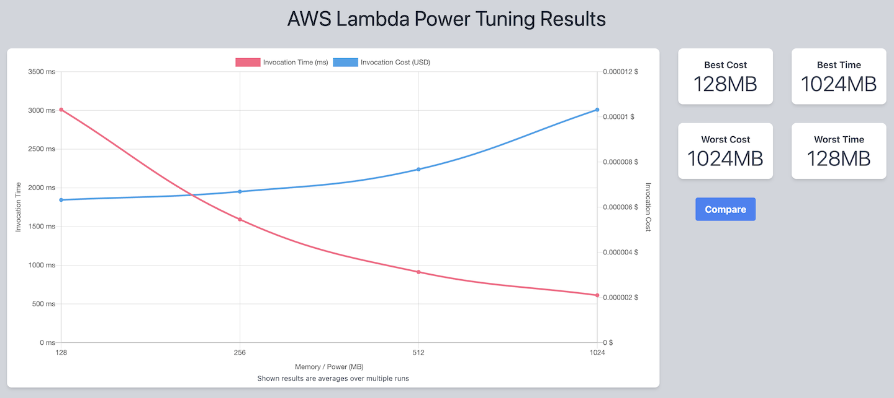

# Profiling and Tuning on AWS

## Overview

A list of profiling and tuning tools available on AWS, each with a runnable example against a shared sample application.

The sample application is a minimal serverless CRUD stack (API Gateway → Lambda → DynamoDB). See [sample-app/README.md](sample-app/README.md) for its architecture and API.

## List of Tools

| # | Tool | 
|---|------|
| 01 | AWS Lambda Power Tuning | 

---

## 01. AWS Lambda Power Tuning

### Overview

[AWS Lambda Power Tuning](https://serverlessrepo.aws.amazon.com/applications/arn:aws:serverlessrepo:us-east-1:451282441545:applications~aws-lambda-power-tuning) is an open-source Step Functions state machine that finds the optimal memory setting for a Lambda function. You point it at a function ARN and it invokes that function repeatedly across a range of memory sizes (128 MB → 10,240 MB), measures duration and cost at each size, and reports the configuration that is cheapest, fastest, or the best balance of the two — plus a URL to a visualization of the cost/speed curve.

Because Lambda scales CPU proportionally with memory, more memory is often both faster *and* cheaper. The tool replaces guesswork with measured data.

It is deployed from the AWS Serverless Application Repository.

### Quick start on sample app

#### 1. Deploy the sample app

Go through [sample-app/README.md](sample-app/README.md) and deploy the sample app. This deploys a sample serverless CRUD stack (API Gateway → Lambda → DynamoDB).

Note the Lambda function ARN and the API URL from the outputs:

```bash
terraform output -raw lambda_function_arn
```

#### 2. Deploy Lambda Power Tuner

Go through [01.lambda_power_tuner/README.md](01.lambda_power_tuner/README.md) and deploy the sample app. This deploys the Serverless Application Repository application `aws-lambda-power-tuning` as a CloudFormation stack, creating the Step Functions state machine and its supporting Lambda functions. 

#### 3. Run Lambda Power Tuner over Lambda function
From the AWS Management Console, go to Step Functions. A state machine with prefix `powerTuningStateMachine-` should be there. 

Select the state machine and click "Start execution". In the "Input" section, put below json with replacing the lambdaARN.

```json
{
  "lambdaARN": "<LAMBDA ARN>",
  "powerValues": [
    128,
    256,
    512,
    1024
  ],
  "num": 10,
  "payload": {
    "operation": "list",
    "tableName": "lambda-apigateway",
    "payload": {}
  },
  "parallelInvocation": true,
  "strategy": "cost"
}
```

Then click "Start execution".

#### 4. Check state machine output

Once the execution of the state machine finished, state output will be provided in "Execution input and output" tab. Belos is an example. (visualization URL is reducted)

```json
{
  "power": 128,
  "cost": 0.0000063231000000000005,
  "duration": 3010.008333333333,
  "stateMachine": {
    "executionCost": 0.00045,
    "lambdaCost": 0.0003091767,
    "visualization": "https://lambda-power-tuning.show/..."
  }
}
```

A visualization of the cost/speed curve is provided in the visualization URL.

#### 5. Interpret the result

Here is a example visualization.




The x-axis is the memory size tested. Two series are plotted against it, each with its own y-axis:
- Invocation Time (ms) — red, left axis. Average duration of one invocation at that memory size.
- Invocation Cost (USD) — blue, right axis. Average cost of one invocation at that memory size.


In this specific example, moving from 128 MB to 256 MB cuts latency roughly in half for about a 6% cost increase. Beyond 256 MB, paying  more per invocation result in progressively smaller latency wins. 

Based on the result, users can choose a preferred Lambda configuration based on their cost/performance requirements.

From a performance perspective, the fact that increasing CPU/memory does not reduce latency indicates the function is not Lambda resource-bound. Instead, the bottleneck may lie elsewhere—for example, in Lambda's communication with external services. The Lambda function in the sample app might mostly waits on DynamoDB. 


#### 6. Delete resources

Delete sample app and Lambda Power Tuner by `terraform destroy`.